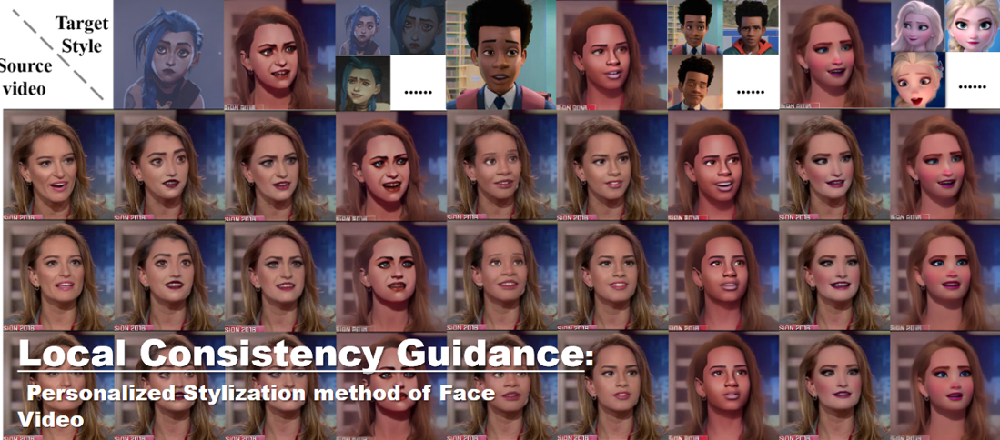

<!DOCTYPE html>
<html>
	<head>
		<meta charset="utf-8">
		<title>helloworld </title>
	
	</head>
	<body bgcolor="#d3d3d3">
	

	

	  

	

	

	  
Local Consistency Guidance: Personalized Stylization method of Face
	Video

	

	

		
			Face video stylization aims to transform real face videos into specific reference styles. While one-shot methods have demonstrated remarkable results in single-image stylization, addressing the continuity between frames and preserving the original facial expressions when generating videos remains a significant challenge in the field of video stylization. To tackle these issues, this paper introduces a personalized diffusion model with pixel-level control. In this study, we propose an innovative approach for facial video stylization that ensures consistent quality throughout the entire video through local consistency. Specifically, we present a framework based on existing diffusion techniques and employ local consistency as a guiding principle. This approach incorporates a local-cross attention module to address style consistency between frames and a local style transfer module to ensure video continuity. We further conducted comparative experiments, qualitative and quantitative analyses utilizing frame consistency, SSIM, and flow similarity parameters, and included an ablation experiment section. The experimental results demonstrate that our approach effectively achieves continuous video stylization through the use of local consistency guidance. We also find that the LCG (Local Consistency Guidance) method performs effectively in achieving continuous video stylization. After an extensive investigation, this work has achieved state-of-the-art results in the field of video stylization. 
		
	

	

	

		
待填写

		

	

	

		
待填写

		&nbsp;&nbsp;&nbsp;&nbsp;&nbsp;source&nbsp;&nbsp;&nbsp;&nbsp;&nbsp;&nbsp;&nbsp;&nbsp;&nbsp;&nbsp;&nbsp;elsa&nbsp;&nbsp;&nbsp;&nbsp;&nbsp;&nbsp;&nbsp;&nbsp;&nbsp;&nbsp;&nbsp;&nbsp;jinkesi&nbsp;&nbsp;&nbsp;&nbsp;&nbsp;&nbsp;&nbsp;&nbsp;&nbsp;&nbsp;&nbsp;miles
		
		 
		  
		  
		  
	

	

		
		 
		 
		 
	

	

		
待填写

	&nbsp;&nbsp;&nbsp;&nbsp;&nbsp;source&nbsp;&nbsp;&nbsp;&nbsp;&nbsp;&nbsp;&nbsp;&nbsp;&nbsp;&nbsp;&nbsp;elsa&nbsp;&nbsp;&nbsp;&nbsp;&nbsp;&nbsp;&nbsp;&nbsp;&nbsp;&nbsp;&nbsp;&nbsp;jinkesi&nbsp;&nbsp;&nbsp;&nbsp;&nbsp;&nbsp;&nbsp;&nbsp;&nbsp;&nbsp;&nbsp;miles
		
		 
		  
		  
		  
	

	

		
		 
		 
		 
	

	

		end
	

	</body>
 </html>
